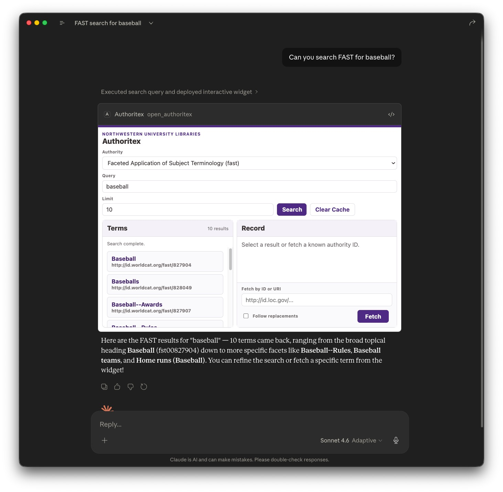
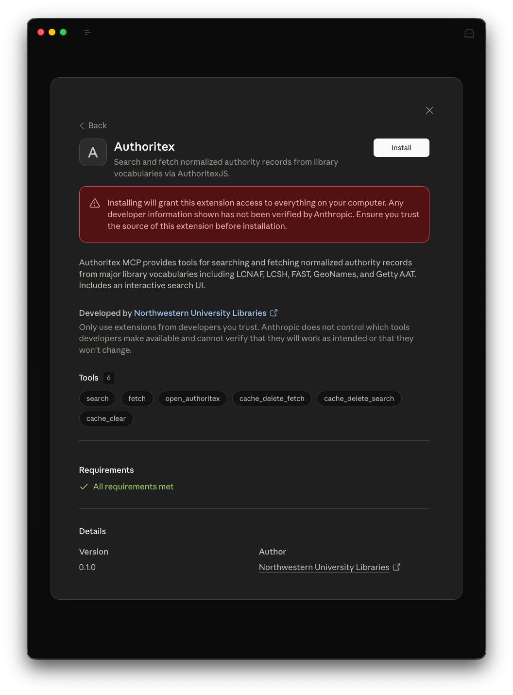
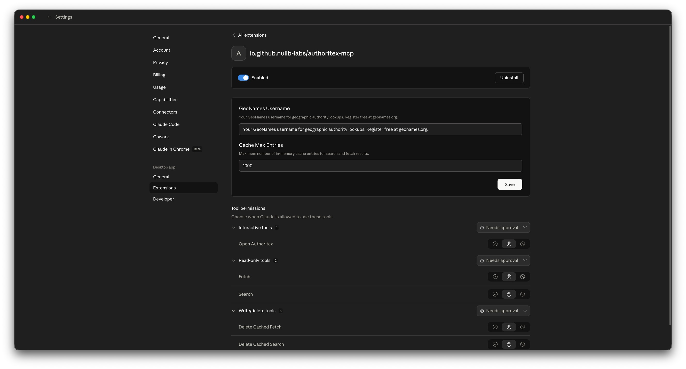
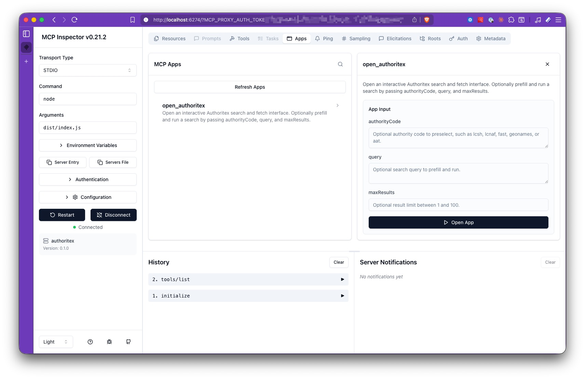
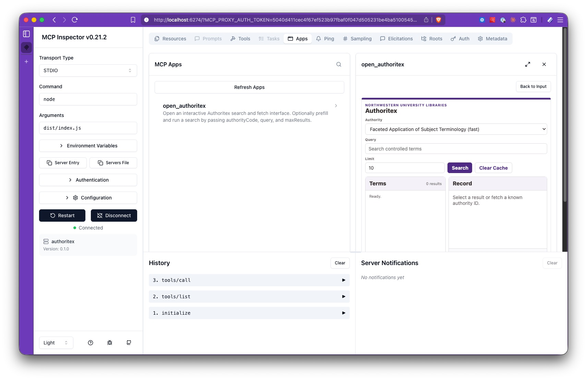

# @nulib/authoritex-mcp

MCP server for searching and fetching normalized authority records through Authoritex.

- npm: `@nulib/authoritex-mcp`
- repo: <https://github.com/nulib-labs/authoritex-mcp>
- companion library: [`@nulib/authoritex-js`](https://github.com/nulib-labs/authoritex-js)

## Run

Run directly with `npx`:

```bash
npx -y @nulib/authoritex-mcp
```

Or install it into a project:

```bash
npm install @nulib/authoritex-mcp
```

## MCP Client Configuration

Example MCP client configuration:

```json
{
  "mcpServers": {
    "authoritex": {
      "command": "npx",
      "args": ["-y", "@nulib/authoritex-mcp"],
      "env": {
        "GEONAMES_USERNAME": "example_user"
      }
    }
  }
}
```

## What It Exposes

Tools:

- `fetch`
- `search`
- `open_authoritex`
- `cache_delete_fetch`
- `cache_delete_search`
- `cache_clear`

Resources:

- `authoritex://authorities`
- `ui://authoritex/search.html`

`open_authoritex` launches a lightweight MCP App for interactive authority searching and fetching in clients that support MCP Apps. The app is plain HTML, CSS, and JavaScript, and calls the server's existing `search`, `fetch`, and `cache_clear` tools through the MCP Apps host bridge.



## Claude Desktop Installation

Authoritex MCP is distributed as an `.mcpb` bundle for one-click installation in Claude Desktop.

Download the `.mcpb` file from the [latest GitHub release](https://github.com/nulib-labs/authoritex-mcp/releases/latest), then open it directly or drag it into Claude Desktop to install.

If you want to build the bundle locally:

```bash
npm run build
npx @anthropic-ai/mcpb pack .
```

This validates `manifest.json`, bundles `dist/` and its dependencies, and produces an `authoritex-mcp-<version>.mcpb` file. The release workflow attaches the same bundle format to each GitHub release.



After installing, configure Authoritex in the Claude Desktop app Connector settings screen, where you can enter your GeoNames username and adjust the cache size.



## Environment Variables

- `GEONAMES_USERNAME` for GeoNames lookups
- `AUTHORITEX_CACHE_MAX_ENTRIES` to set the maximum number of in-memory cache entries. Defaults to `1000`.

The server enables the bundled `authoritex-js` in-memory cache by default. Cached authority fetches and searches reduce duplicate upstream provider calls during long-running MCP sessions. Fetch results use the library default TTL of 24 hours, and search results use the library default TTL of 5 minutes. Entries may be removed earlier if the cache reaches `AUTHORITEX_CACHE_MAX_ENTRIES`.

Cache management tools use semantic inputs instead of raw cache keys:

- `cache_delete_fetch` deletes cached fetch results for an authority URI or ID
- `cache_delete_search` deletes cached search results for an authority, query, and optional result limit
- `cache_clear` clears all cached Authoritex fetch and search results

## Local Development

Clone the MCP server repo and use the standard local workflow:

```bash
git clone https://github.com/nulib-labs/authoritex-mcp.git
cd authoritex-mcp
npm install
```

Recommended commands:

- `npm run typecheck`
- `npm run build`
- `npm run serve`

`npm run serve` starts the stdio server from `dist/index.js`.

## Testing with MCP Inspector

Build the server, then launch the MCP Inspector against the stdio entrypoint:

```bash
npm run build
npx @modelcontextprotocol/inspector node /path/to/authoritex-mcp/dist/index.js
```

If you need GeoNames while testing, prefix the Inspector command with `GEONAMES_USERNAME`:

```bash
GEONAMES_USERNAME=example_user npx @modelcontextprotocol/inspector node /path/to/authoritex-mcp/dist/index.js
```

On first run, `npx` may prompt to install `@modelcontextprotocol/inspector`. After it starts, open the local Inspector URL shown in the terminal and connect to the spawned stdio server.

Once connected, load capabilities and verify that the server exposes:

- tools: `fetch`, `search`, `open_authoritex`, `cache_delete_fetch`, `cache_delete_search`, `cache_clear`
- resources: `authoritex://authorities`, `ui://authoritex/search.html`

The Apps tab shows `open_authoritex` with its input form for prefilling a search:



Clicking "Open App" renders the Authoritex UI inline in the Inspector:


